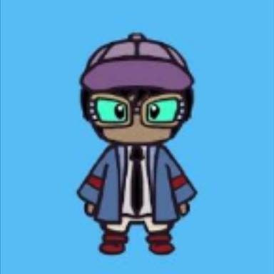

  

# Theme

You’re a master's student. Your thesis is coming up. You need an advisor. You can't find anyone. You’re stressed, you don't know what to do, the world seems to spin and your life seems meaningless but there's no way out and nowhere to go. The path is riddled with obstacles. Your life is getting absurd. When the going gets tough, will you still keep going?

# Prizes

All in all, we are giving away **7 prizes**.

## 1) Main Quest

The main quest follows a linear storyline, like a game, and **No Knowledge of Coding Is Required to Solve it**. There are 3 prizes-

1. First Prize:- **An Amazon Gift Card worth ₹800 and a goody**
2. Second Prize:- **An Amazon Gift Card worth ₹500**
3. Third Prize:- **An Amazon Gift Card worth ₹300**

## 2) Side Quests

There are 4 side quests in the game spread across the games, and there's a prize for each. The prize would go to the team solving them first-

1. Labyrinth Side Quest- **An Amazon Gift Card worth ₹500 and a goody**
2. Side Quest 2 - **An Amazon Gift Card worth ₹100 and a goody**
3. Side Quest 3 - **An Amazon Gift Card worth ₹100 and a goody**
4. Side Quest 4 - **An Amazon Gift Card worth ₹100 and a goody**

The Labyrinth Side Quest requires a **minimal** knowledge of coding to solve it. You need to know `loops` and `if-else`. The other 3 side quests require some knowledge about computers in general. 

A prize would be given to a team that completes a side quest first.

# Interested?

Register at [https://bit.ly/Turing Hunt](https://bit.ly/Turing Hunt). Yep, we got a fancy link too!

# Download Links

Would appear here.

# Promotions

The event has been organized by the [Turing Club, IISER Mohali](https://iiserm.github.io/turing-club/). You can also find us on [Twitter](https://twitter.com/Turing_IISERM?s=20&t=rLMk5rEh60kLV31UfKQuKA) and [Instagram](https://instagram.com/turing_iiserm?utm_medium=copy_link). 

The game has been built using [Tetra](https://github.com/DhruvaSambrani/turing-hunt-engine). Tetra is a game engine/game development framework. You can use it for building your own treasure hunts as well. 

# Meet The Team

You can find the faces of our amazing team below-

  

    
    
Abhay Gupta   <b>Aliases: </b>Assassin Gupta

  

  

    
    
Ajay Sharma   <b>Aliases: </b>Ajay

  

  

    
    
Akshay Shankar   <b>Aliases: </b>Akshay

  

  

    
    
Aprameyan Desikan   <b>Aliases: </b>Apra Man

  

  

    
    
Dhruva Sambrani  <b>Aliases: </b>Dhruva 

  

  

    
    
James  <b>Aliases: </b> Darkness Sensei

  

  

    
    
Jayashree Narayan   <b>Aliases: </b> J

  

  

    
    
Rochan Das   <b>Aliases: </b> Rochan

  

  

    
    
Sachin Iyer   <b>Aliases: </b> Sachin

  

  

    
    
Sourav Suresh   <b>Aliases: </b> Sourav

  

  

    
    
Swastik Patnaik   <b>Aliases: </b> Swastika

  

