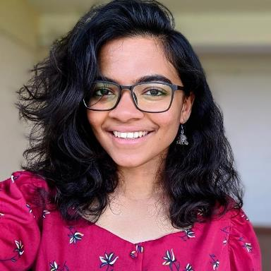

  

**Registration Link-** [https://bit.ly/TuringHunt](https://bit.ly/TuringHunt)

**People outside IISER Mohali are welcome to participate. However, they can't win prizes. Feel free to register at the same link**

# Time

**1st April, 9 pm**
Join online and stay connected with us on WhatsApp. Or visit us in H6 study room if you have a doubt.

# Theme

You’re a master's student. Your thesis is coming up. You need an advisor. You can't find anyone. You’re stressed, you don't know what to do, the world seems to spin and your life seems meaningless but there's no way out and nowhere to go. The path is riddled with obstacles. Your life is getting absurd. When the going gets tough, will you still keep going?

## Trailer

<iframe width="560" height="315" src="https://www.youtube-nocookie.com/embed/AeqxuTZfrMI" title="YouTube video player" frameborder="0" allow="accelerometer; autoplay; clipboard-write; encrypted-media; gyroscope; picture-in-picture" allowfullscreen></iframe>

# Prizes

All in all, we are giving away **7 prizes**.

## 1) Main Quest

The main quest follows a linear storyline, like a game, and **No Knowledge of Coding Is Required to Solve it**. There are 3 prizes-

1. First Prize:- **An Amazon Gift Card worth ₹800 and a goody**
2. Second Prize:- **An Amazon Gift Card worth ₹500**
3. Third Prize:- **An Amazon Gift Card worth ₹300**

## 2) Side Quests

There are 4 side quests in the game spread across the games, and there's a prize for each. The prize would go to the team solving them first-

1. Labyrinth Side Quest- **An Amazon Gift Card worth ₹500 and a goody**
2. Side Quest 1 - **An Amazon Gift Card worth ₹100 and a goody**
3. Side Quest 2 - **An Amazon Gift Card worth ₹100 and a goody**
4. Side Quest 3 - **An Amazon Gift Card worth ₹100 and a goody**

The Labyrinth Side Quest requires a **minimal** knowledge of coding to solve it. You need to know `loops` and `if-else`. The other 3 side quests require some knowledge about computers in general. 

A prize would be given to a team that completes a side quest first.

The side quests are independent of the main quest. You can win the main quest without having any knowledge of coding.

# Interested?

Register at [https://bit.ly/TuringHunt](https://bit.ly/TuringHunt). Yep, we got a fancy link too! **OR ELSE-**

  

# Download Links

**Note: The game is about 50MB. So please make sure you don't use up all your data**

| OS             | `ldd` | Download from                                   |
| -------------- | ----- | ----------------------------------------------- |
| Windows        | NA    | [main-win.exe](./binaries/main-win.exe)         |
| Ubuntu 18.04   | 27    | [main-2-27](./binaries/main-2-27)               |
| Ubuntu 21.04   | 33    | [main-2-33-ubuntu](./binaries/main-2-33-ubuntu) | 
| Debian Testing | 33    | [main-2-33-debian](./binaries/main-2-33-debian) | 
| Arch/Manjaro   | 35    | [main-2-35](./binaries/main-2-35)               |

## How to Run

### Windows

1. Download the windows version of the game
2. Double click the downloaded file.
3. Click `Run Anyway` if a Security pop up comes up.
4. Once the font install pop up occurs, **INSTALL THE FONT, CLOSE THE APP AND RESTART**
5. Enjoy

### Linux

1. Download the Linux version. If you use a Linux not in the above list, run `ldd --version` in your terminal. This will give your `ldd` version number. Use the version with the **highest `ldd` value lower than yours**.
2. Open a terminal and run `chmod +x /path/to/file` wherever the file is located
3. Run `./path/to/file`
4. Once the font install pop up occurs, **INSTALL THE FONT, CLOSE THE APP AND RESTART**
5. Enjoy

### Mac

1. Throw your Mac into a trash can
2. Get a friend who has a Windows or Linux laptop
3. Follow the appropriate instructions
4. Enjoy
5. Light fire to the trash can

# Promotions

The event has been organized by the [Turing Club, IISER Mohali](https://iiserm.github.io/turing-club/). You can also find us on [Twitter](https://twitter.com/Turing_IISERM?s=20&t=rLMk5rEh60kLV31UfKQuKA) and [Instagram](https://instagram.com/turing_iiserm?utm_medium=copy_link). 

The game has been built using [Tetra](https://github.com/DhruvaSambrani/turing-hunt-engine). Tetra is a game engine/game development framework. You can use it for building your own treasure hunts as well. 

# Meet The Team

You can find the faces of our amazing team below-

 
  

    <figure>
      
      <figcaption>Abhay "Assassin" Gupta</figcaption>
    </figure>
    <figure>
      
      <figcaption>Ajay "NatalTiger26" Sharma</figcaption>
    </figure>
    <figure>
      
      <figcaption>Akshay Shankar</figcaption>
    </figure>
  

  

    <figure>
      
      <figcaption>Aprameyan "Apra Man" Desikan</figcaption>
    </figure>
    <figure>
      
      <figcaption>Dhruva Sambrani</figcaption>
    </figure>
    <figure>
      
      <figcaption>Swastik "Swastika" Patnaik</figcaption>
    </figure>
  

  

    <figure>
      
      <figcaption>Rochan "rorochan" Das</figcaption>
    </figure>
    <figure>
      
      <figcaption>Sachin Iyer</figcaption>
    </figure>
    <figure>
      
      <figcaption>Sourav Suresh</figcaption>
    </figure>
  

  

    <figure>
      
      <figcaption>"Darkness Sensei" James</figcaption>
    </figure>
    <figure>
      
      <figcaption>Jayashree "J" Narayan</figcaption>
    </figure>
  

